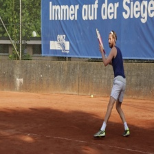
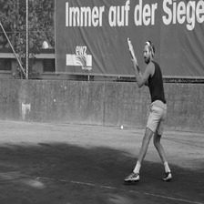
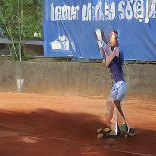
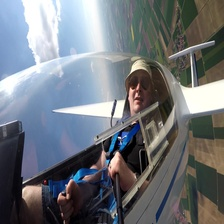
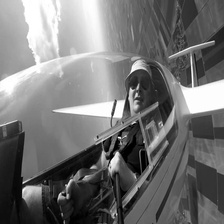
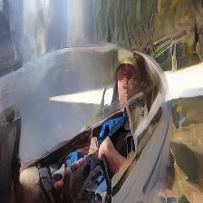
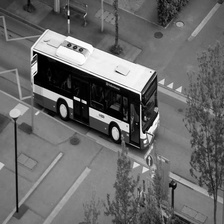
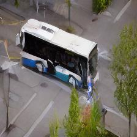

# Video Colorization Based on a Diffusion Model Implementation

<p align="center">
  
  
</p>

This repository has the code used to perform Deep Learning Video Colorization (DLVC) using the Denoising Diffusion Probabilistic Model (DDPM) performing denoising in the latent space. The frames are encoded by an encoder $\mathcal{E}$ pre-trained on the ImageNet dataset to convert the frame from pixel to latent space. This process is realized to decrease the size of samples, making the diffusion process more efficient in training. The conversion from latent space back to pixel space is the responsibility of the pre-trained decoder $\mathcal{D}$.

To guide the denoising process of the diffusion model, a pre-trained visual transformer denoted Visual Attention Conditioning (VAC) is used, where the grayscale frame $R$ is transformed into latent space, denoted $\mathcal{V}{\text{features}}$, to serve as a reference for the DMLC (Diffusion Model Latent Colorization). After performing the denoising, $\mathcal{L}{\text{at}c}$, the result is a colorized version denoted $S{c}$ of the input frame $R$.

The paper is available for download from the following link: [Video Colorization Based on a Diffusion Model Implementation](https://link.springer.com/chapter/10.1007/978-3-031-66329-1_10)

## Archicteure
The implementation of the project is presented below, where the pre-trained coders and the data flow are described:

<p align="center">
    
</p>

## Paper Results
A comparison of the quantitative results presented in the paper with those of other authors reveals an increase in the metrics of FID and CDC.

| **Comparison** | **PSNR $\uparrow$** | **SSIM $\uparrow$** | **CDC $\downarrow$** | **FID $\downarrow$** |
|----------------|---------------------|---------------------|----------------------|----------------------|
| Lei et al.     | 30.35               | -                   | -                    | $6.22 \times 10^{-4}$ |
| Chen et al.    | -                   | -                   | $4.02 \times 10^{-3}$| $5.87 \times 10^{-4}$ |
| Huang et al.   | 30.61               | -                   | -                    | $6.87 \times 10^{-4}$ |
| Ours           | 27.95               | 0.27                | $3.19 \times 10^{-3}$| $5.02 \times 10^{-4}$ |

Additionally, the qualitative results exhibited a favorable color distribution within the frames, although some artifacts were observed in the details, particularly in the form of faces and text.

<table style="width:100%; text-align:center;">
    <tr>
        <th style="text-align:center;">Original frame $R$</th>
        <th style="text-align:center;">Gray version $S_g$</th>
        <th style="text-align:center;">Colorized version $S_c$</th>
    </tr>
    <tr>
        <td style="text-align:center;"><div style="display:inline-block;"></div></td>
        <td style="text-align:center;"><div style="display:inline-block;"></div></td>
        <td style="text-align:center;"><div style="display:inline-block;"></div></td>
    </tr>
    <tr>
        <td style="text-align:center;"><div style="display:inline-block;"></div></td>
        <td style="text-align:center;"><div style="display:inline-block;"></div></td>
        <td style="text-align:center;"><div style="display:inline-block;"></div></td>
    </tr>
    <tr>
        <td style="text-align:center;"><div style="display:inline-block;"></div></td>
        <td style="text-align:center;"><div style="display:inline-block;"></div></td>
        <td style="text-align:center;"><div style="display:inline-block;"></div></td>
    </tr>
</table>


# How to Use This Tool

## Requirement
Make sure you’ve got these bad boys installed before you dive in:
- `torch` >= 2.0.1
- `torchvision` >= 0.15.2
- `cuda` >= 12.1
- `diffusers` >= 0.16.1

## Evaluation 
To evaluate your model (aka see some magic happen), use the ```video_colorization.py```, script. Just point it to the  ```dataroot``` with your grayscale video, and voilà, your colorized video will be saved at ```/video_output/colorized_video.mp4``` No need for a time machine!

## Training
Want to train on your own data? Great! Just follow these easy-peasy steps.

### Data Sctutre
First, get your data organized like a tidy computer scientist. Here's the structure you need:
```
└── root
    └── video
        ├── 00000.jpg
        ├── 00001.jpg
        └── 00002.jpg
    └── video1
        ├── 00000.jpg
        ├── 00001.jpg
        └── 00002.jpg
    └── video2
        ├── 00000.jpg
        ├── 00001.jpg
        └── 00002.jpg
```

### Latent Space
Next up, let’s create the latent space of those video frames. Use ```feature_exctration.py``` to do the heavy lifting. After running it, you’ll get a fancy ```latent.npz``` containing all tensor will be created at the folder ```/data/DATASET_NAME/```. This is basically the secret sauce that DMLC uses to colorize your grayscale frames.

### Training diffusion
Now for the main event: training. Use the ```train_diffusion.py``` script to kick off the training process. The network topology is defined in ```modules.py```, where is possible change how layers are present. or deeper layers (more like diving into the deep end), you can adjust the *net_dimension* parameter. Once trained, your model will be stored in the  ```unet_model``` folder. Success.

## Citation
```
@inproceedings{stival2024video,
  title={Video Colorization Based on a Diffusion Model Implementation},
  author={Stival, Leandro and da Silva Torres, Ricardo and Pedrini, Helio},
  booktitle={Intelligent Systems Conference},
  pages={117--131},
  year={2024},
  organization={Springer}
}
```
